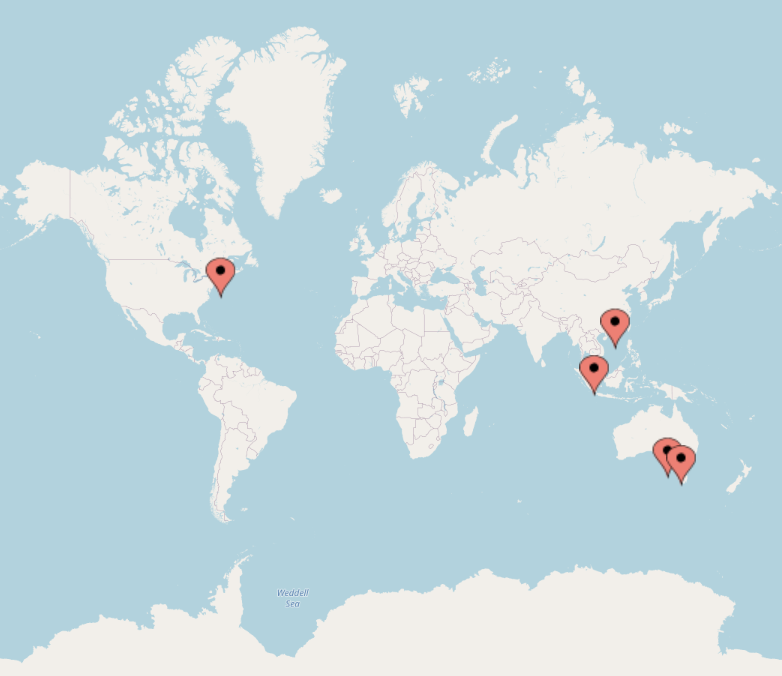

Where local conditions permit, members of the Cognitive Science Society will be organizing meetup groups in conjunction with
[CogSci 2021](  https://cognitivesciencesociety.org/cogsci-2021/ ). The goal is to facilitate interactions between cognitive scientists who live in the same city, and some suggestions about possible elements of a meetup are provided [here](meetupformat.html ).  Currently meetups are planned in: 

* [Adelaide]( adelaide.html ) ( organizer [Keith Ransom](  https://its.almostcertainly.me/) )
* [Boston/Cambridge]( boston.html ) ( organizer [Noga Zaslavsky]( https://www.nogsky.com/) )
* [Hong Kong]( https://psychology.hku.hk/content/cogsci2021hk/ ) ( organizer [Janet Hsiao]( http://web.hku.hk/~jhsiao/ ) )
* [Melbourne]( melbourne.html)  ( organizer [Charles Kemp]( http://charleskemp.com ) )
* [Singapore]( https://desmond-ong.github.io/cogscimeetups21-sg/  )  ( organizer [Desmond Ong ](  http://www.comp.nus.edu.sg/~dongch ) )

If you'd like to attend the meetup in one of these places, please follow the link above for more details. If you don't live in one of these places and would like to organize a meetup group in your own city, please contact Charles Kemp at `c.kemp@unimelb.edu.au`. All meetups are expected to follow the meetup  [Code of Conduct](codeofconduct.html) and to respect local policies related to [COVID-19](covid19.html).

This webpage was developed by a Local Planning Group consisting of [Dave Barner](  http://www.ladlab.com/barner ), [Stephanie Denison](  https://uwaterloo.ca/psychology/people-profiles/stephanie-denison ) and [Charles Kemp]( http://charleskemp.com ). Please get in touch with any one of us if you have ideas to share. 

<!-- mapcustomizer.com --> 
